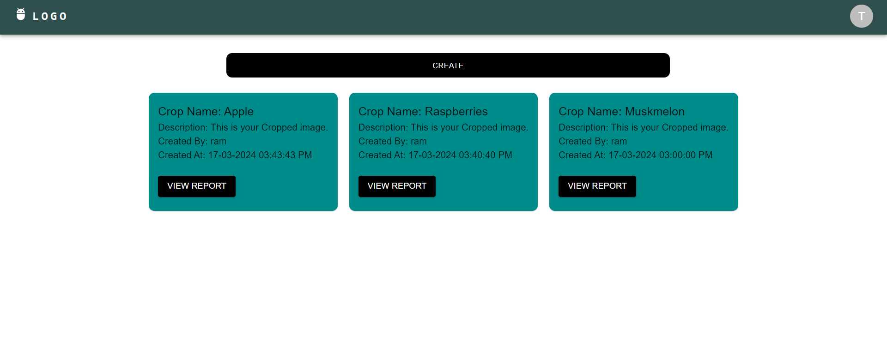
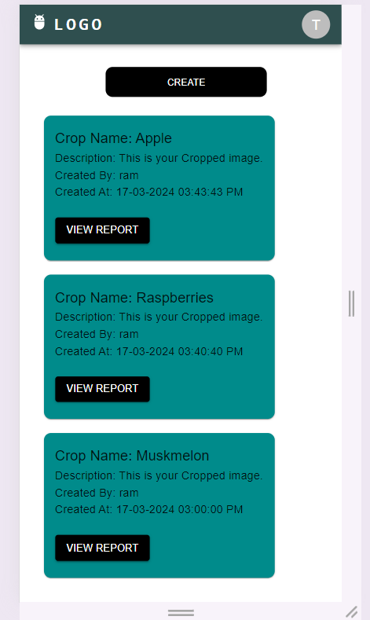

# Commodity PWA frontend

## Setting up project

1. Clone the repository in your workspace by `git clone https://github.com/ramsingh10497/Commodity_crop_PWA_frontend.git`
2. go inside the folder `Commodity_crop_PWA_frontend`
3. run `npm install`. This will install all requited packages

4. Create a .env file and copy and pase the code from .env.example

5. Clone the `commodity_backend` repository and follow its `README.md` for setting up the server.

6. run `npm start` to launch the PWA

## Screenshots

## Offline support

1. This app supports offline mode and will show proper error messages and popup when in offline mode.
2. App can be installed in Mobile devices by opening the frontend in mobile browsers.
3. Open the home url and select `Add to Home Page`, option available in almost all new browsers
